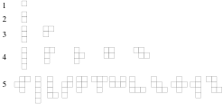

# Free Polyomino (A000105) generator

A polyomino is a simple shape made of squares connected on their edges, think of Tetris shapes. The order of a polyomino refers to how many squares make up the shape. for example Order 3 contains 3 sqares. There are only two free members of Order 3, a bar with 3 squares in a row, and an L.
 Credit https://mathworld.wolfram.com/Polyomino.html 

This repo is where the work I'm doing on porting some C# code, which I wrote back in 2007 for a Math research project on generating polyominoes while I was a physics undergrad, to Golang.

In the process I want to really get into learning more about building out a full Golang project, from starting with tests to prove out my functions/math/generation code, using Goroutines for multithreaded speedup of work, to creating a full gRPC service for managing the work related to generating new polyomino orders, and checking that they are free (unique) polyominos.

The fun part of all of this is that creating new polyominoes and checking if they are unique is a hard problem that grows exponentially.

Back in 2007 our research computer with a quad core Xeon could manage generating all of order 14 polyominoes in about 14 days. My Ryzen 5950x on a single core using the same C# code was able to generate all of order 14 in less than 4 hours. There are 901971 free polyominoes in order 14 see https://mathworld.wolfram.com/Polyomino.html and https://en.wikipedia.org/wiki/Polyomino and https://www.gathering4gardner.org/g4g10gift/math/Shirakawa_Toshihiro-Harmonic_Magic_Square.pdf
